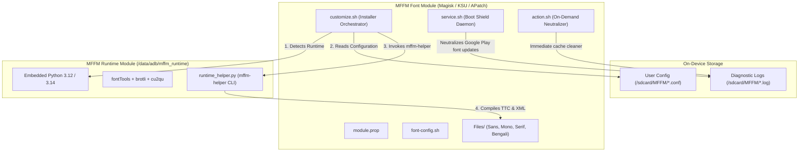

# MFFMv14 Developer & Architecture Guide
### Internal Architecture, Typography Algorithms, and Developer Reference

---

## 1. System Architecture & Lifecycle

MFFMv14 employs a **split-architecture** model separating font packaging/customization from the underlying font transformation compiler:



### Module Responsibilities
1. **Font Module**:
   - Holds source font binaries (`Files/Sans/`, `Files/Monospace/`, `Files/Serif/`, `Files/Bengali/`).
   - Carries metadata: `font-config.sh` (variable axis ranges, default weights, fallback priorities) and `module.prop`.
   - Manages installation orchestration via `customize.sh`.
   - Manages anti-override protection via `service.sh` and `action.sh`.
2. **MFFM Runtime (`mffm-runtime-*.zip`)**:
   - Installed once into `/data/adb/mffm_runtime/`.
   - Provides a standalone, statically linked Python binary (`aarch64` and `x86_64`) with pre-packaged wheels: `fontTools`, `brotli`, and `cu2qu`.
   - Exposes `mffm-helper` on `$PATH` via symlink `/data/adb/mffm_runtime/bin/mffm-helper`.

---

## 2. Typography & Metric Engineering

### 2.1 Decoupled Safe Metrics Engine

#### The Problem: Monospace & UI Height Inflation
In Android font rendering, vertical line-spacing is calculated by Android's font stack (Minikin and Skia) using vertical metric tables (`OS/2` and `hhea`).
- Traditional scripts used fixed FFIX3 metrics ($2128$ ascent, $-550$ descent on a 2048 UPM scale).
- When third-party or multi-script fonts included tall accents (e.g., Vietnamese `ế`, `Ậ`, Devanagari matras, Thai, Polish), single-scale multipliers or coupled expansions inflated both ascent and descent simultaneously.
- In monospace fonts (e.g., Fira Code, JetBrains Mono), coupled metric expansion caused up to **+41% vertical line-height inflation**, making terminal emulators and code editors look distorted.

#### The Decoupled Clamping Algorithm
MFFMv14's Safe Metrics Engine decoupled positive $y$-axis (ascent) expansion from negative $y$-axis (descent) expansion:

```
Ascent Boundary:
  target_ascent = max(baseline_ascent, min(glyph_yMax, max_ascent_cap))

Descent Boundary:
  target_descent = min(baseline_descent, max(glyph_yMin, max_descent_cap))
```

1. **Glyph Bounding Box Audit**:
   Every glyph contour in the font is inspected for absolute extremes ($yMin, yMax$).
2. **Independent Expansion**:
   - If a tall Vietnamese diacritic reaches $yMax = 2300$, only the ascent expands to $2300$. The descent remains at its compact baseline ($-550$).
   - If a deep Arabic or script descender reaches $yMin = -650$, only the descent expands downward. The ascent remains compact.
3. **Multi-Table Synchronization**:
   To prevent rendering inconsistencies between Skia, Minikin, and FreeType, the following table values are strictly synchronized:
   - `OS/2.sTypoAscender = target_ascent`
   - `OS/2.sTypoDescender = target_descent`
   - `OS/2.sTypoLineGap = 0`
   - `OS/2.usWinAscent = target_ascent`
   - `OS/2.usWinDescent = abs(target_descent)`
   - `hhea.ascender = target_ascent`
   - `hhea.descender = target_descent`
   - `hhea.lineGap = 0`

---

### 2.2 Contextual Centered Clock Colon (GSUB Format 6)

#### The Problem
Standard fonts place the punctuation colon (`:`, U+003A) on or near the baseline to align with lowercase text (e.g., `"file: path"`). On Android lockscreens and status bar clocks (`12:30`), this baseline colon appears sunken and visually unbalanced.

#### FontTools Injection Pipeline
MFFMv14 injects a dedicated vertically centered glyph (`colon.case`) and wires it through an OpenType GSUB Lookup Type 6 (Chaining Contextual Substitution):

1. **Glyph Synthesis**:
   - If `colon.case` is not present, MFFM duplicates the contours of `colon`.
   - The dot contours are shifted vertically by $\Delta y$:
     $$\Delta y = \frac{H_{cap} - (yMin + yMax)}{2}$$
   - When `COLON_ALIGNMENT=center`, $H_{cap}$ is replaced by digit midpoint height:
     $$\Delta y = \frac{Midpoint_{digit} - (yMin + yMax)}{2} + COLON\_OFFSET$$
2. **Contextual Lookup Assembly**:
   An OpenType `Lookup` of Type 6 (Chaining Contextual Substitution Format 6) is synthesized in `GSUB.LookupList`:
   - **Backtrack Coverage**: Glyphs `0` through `9` (and tabular digit counterparts).
   - **Input Coverage**: `colon` (and `colon.tf`).
   - **Lookahead Coverage**: Glyphs `0` through `9` (and tabular digit counterparts).
   - **SubstLookupRecord**: References a Type 1 (Single Substitution) lookup mapping `colon` $\to$ `colon.case`.
3. **Feature Attachment**:
   The contextual lookup index is registered in the font's active language features (`DFLT`, `latn` under features `ccmp`, `locl`, or `calt`).

---

### 2.3 Tabular Digit Equalization

#### The Problem
Proportional number designs assign different advance widths to different numerals (e.g., `1` is significantly narrower than `0` or `8`). When seconds tick or minutes flip on Android lockscreens, proportional digits cause the clock to visibly wobble horizontally.

#### Equalization Pipeline
1. Identifies digits `0` through `9` (and unicode variants `0x0030` to `0x0039`).
2. Calculates maximum horizontal advance width:
   $$W_{target} = \max_{d \in \{0..9\}} (hmtx[d].advanceWidth)$$
3. Centers the contours of narrower numerals within the standardized cell:
   $$\Delta x = \frac{W_{target} - W_{original}}{2}$$
4. Updates `hmtx` advance width to $W_{target}$, recalculates `leftSideBearing`, and updates the font bounding box in `head` and `glyf`.

---

### 2.4 Zygote Table Optimization & Bloat Pruning

#### The Problem
`/system/fonts/DroidSans.ttf` is memory-mapped (`mmap`) into the **Zygote** root process and inherited by every running app and service. Many desktop fonts carry legacy tables from the 1990s that Android's font stack ignores:
- `DSIG` (Digital Signature): Invalidated upon any modification; causes Minikin warnings.
- `VDMX` and `hdmx`: Obsolete Windows CRT device metrics tables.
- `LTSH`: Windows 3.1 linear threshold table.
- `PCLT`: HP printer control language table.
- `EBDT`, `EBLC`, `EBSC`: Embedded bitmap strikes adding megabytes of unneeded pixel data.
- Duplicate Macintosh Roman (Platform ID 1) name records when Windows Unicode (Platform ID 3) records exist.

#### Optimization Implementation
When `ENABLE_ZYGOTE_OPTIMIZATION=yes` is specified, `runtime_helper.py` calls `optimize_font_tables()`:
- Drops dead tables: `DSIG`, `LTSH`, `VDMX`, `hdmx`, `PCLT`, `EBDT`, `EBLC`, `EBSC`, `bdat`, `bloc`, `bhed`, `JSTF`, `Feat`, `Glat`, `Gloc`, `Silf`, `Sill`, `FFTM`, `TSI0`–`TSI5`, `prop`, `opbd`, `kerx`, `morx`, `mort`.
- Strips Platform ID 1 (Macintosh) name records.
- Standardizes anti-aliasing via `gasp` table flags (`0x000F`).
- Canonicalizes TrueType table ordering using `fontTools.subset.Subsetter`.

---

## 3. Developer & Build Tooling Reference

### 3.1 `build.py` (PC Module Compiler)
Compiles source fonts into a signed, flashable MFFMv14 ZIP.

```sh
python build.py [OPTIONS]
```

| Flag | Type | Description |
| :--- | :--- | :--- |
| `--fonts-dir` | Path | Root source font directory (default: `./Fonts` or `./Files`) |
| `--mode` | Choice | Font detection mode: `auto`, `static`, or `variable` |
| `--name` | String | Override module display name in `module.prop` |
| `--version` | String | Module version string (default: current date `YYYY.MM.DD`) |
| `--version-code` | String | Numeric module versionCode (default: current date `YYMMDD`) |
| `--output-dir` | Path | Target output directory (default: `./dist`) |
| `--features` | String | Comma-separated OpenType features to freeze for Sans |
| `--mono-features` | String | Comma-separated OpenType features to freeze for Monospace |
| `--serif-features` | String | Comma-separated OpenType features to freeze for Serif |
| `--bengali-features` | String | Comma-separated OpenType features to freeze for Bengali |
| `--centered-colon` | Flag | Force centered colon generation/injection |
| `--no-centered-colon` | Flag | Explicitly disable centered colon injection |
| `--interactive` | Flag | Force interactive terminal feature selection prompt |
| `--keep-hinting` | Flag | Preserve original TrueType bytecode instructions |
| `--no-prefix` | Flag | Do not insert `Mistu` internal family metadata branding |
| `--no-sign` | Flag | Create an unsigned debugging ZIP |
| `--no-zip` | Flag | Prepare module payload directory without zipping |
| `--config` | Path | Load options from a JSON config file (default: `.mffm-build.json`) |
| `--save-config` | Flag | Save effective CLI options into `.mffm-build.json` |
| `--inspect` | Flag | Report detected fonts, weights, and axes without building |
| `--template` | Flag | Build `dist/MFFMv14-Source-Template.zip` |
| `--runtime` | Flag | Build standalone `dist/mffm-runtime-YYYY.MM.DD.zip` |

---

### 3.2 `update.py` (Module Migration Utility)
Migrates older MFFM modules (or modern modules) onto the latest MFFMv14 template.

```sh
python update.py [--input <zip_or_dir>] [OPTIONS]
```

- Supports single ZIP migration:
  ```sh
  python update.py -i "Old Modules/mffm14-Amazon-Ember-2026.08.17.zip" --output-dir dist/
  ```
- Supports batch directory migration:
  ```sh
  python update.py --old-dir "Old Modules" --output-dir dist/
  ```

---

### 3.3 `mffm-helper` (On-Device CLI)
Located on-device at `/data/adb/mffm_runtime/bin/mffm-helper`.

```sh
mffm-helper <subcommand> [options]
```

- **`scan <dirs...>`**: Scans directories and outputs JSON report of font families, styles, weights, and variable axes.
- **`ttc --out <output.ttc> <files...>`**: Bundles font binaries into a TrueType Collection.
- **`compile-bundle --out-dir <dir> ...`**: Full multi-family compilation engine executed during module flashing.
- **`report-features ...`**: Discovers available OpenType layout features and formats summary for `.conf`.
- **`inject-colon --in <font> [--out <out>] ...`**: Generates and injects centered clock colon.
- **`equalize-digits --in <font> [--out <out>] ...`**: Equalizes numeral advance widths for lockscreen clocks.
- **`freeze-features --in <font> --features <tags>`**: Bakes OpenType layout features into default glyphs.
- **`otf2ttf --in <font.otf> [--out <font.ttf>]`**: Converts cubic PostScript (CFF) outlines to TrueType quadratic curves using `cu2qu`.
- **`optimize --in <font> [--out <out>]`**: Prunes bloat tables for Zygote RAM performance.
- **`process-font --in <font> ...`**: All-in-one font normalization pipeline.

---

## 4. Contributing & Code Standards

1. **Preserve Documentation & Comments**:
   Never strip existing docstrings or explanatory comments.
2. **POSIX Shell Standards**:
   All shell scripts (`customize.sh`, `service.sh`, `action.sh`, `uninstall.sh`, `post-mount.sh`) must run cleanly under Android's `/system/bin/sh` (Almquist shell / toybox `sh`). Avoid bashisms or GNU-specific flags.
3. **No Unmanaged Tests**:
   Do not commit scratch test scripts to version control. Keep all temporary testing in memory or temporary directories.
4. **Reproducible Packaging**:
   `write_zip()` respects the `SOURCE_DATE_EPOCH` environment variable for bit-for-bit reproducible packaging.
